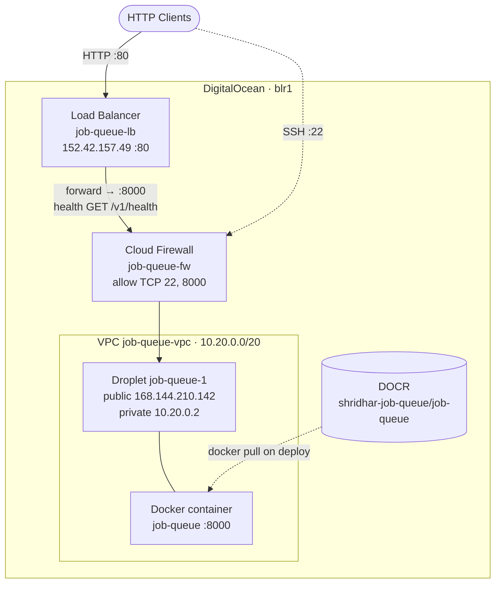
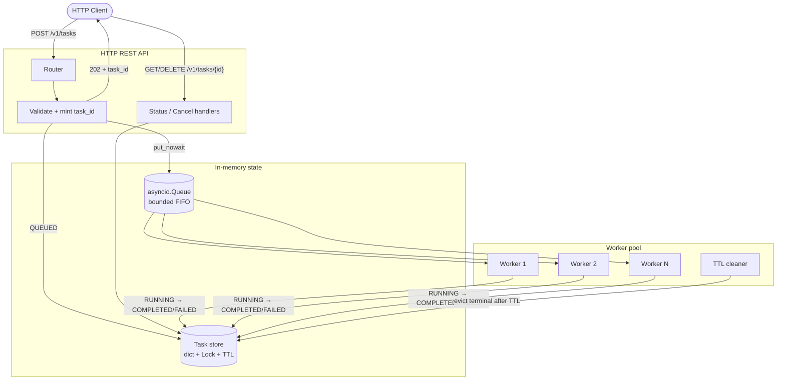
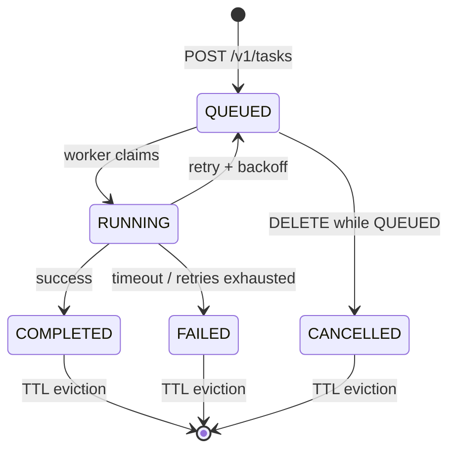

# In-Memory Job Queue

FastAPI REST API, bounded `asyncio.Queue`, and a worker pool — one process, one container.

## Topology

```mermaid
flowchart TB
    Clients(["HTTP Clients"])

    subgraph DO ["DigitalOcean · blr1"]
        LB["Load Balancer<br/>job-queue-lb<br/>152.42.157.49 :80"]
        FW["Cloud Firewall<br/>job-queue-fw<br/>allow TCP 22, 8000"]

        subgraph VPC ["VPC job-queue-vpc · 10.20.0.0/20"]
            Droplet["Droplet job-queue-1<br/>public 168.144.210.142<br/>private 10.20.0.2"]
            Container["Docker container<br/>job-queue :8000"]
            Droplet --- Container
        end

        DOCR[("DOCR<br/>shridhar-job-queue/job-queue")]
    end

    Clients -->|"HTTP :80"| LB
    LB -->|"forward → :8000<br/>health GET /v1/health"| FW
    FW --> Droplet
    DOCR -.->|"docker pull on deploy"| Container
    Clients -.->|"SSH :22"| FW
```

## Application design

```mermaid
flowchart TD
    Client(["HTTP Client"])

    subgraph API ["HTTP REST API"]
        Router["Router"]
        Validator["Validate + mint task_id"]
        Status["Status / Cancel handlers"]
    end

    subgraph State ["In-memory state"]
        Q[("asyncio.Queue<br/>bounded FIFO")]
        Store[("Task store<br/>dict + Lock + TTL")]
    end

    subgraph Workers ["Worker pool"]
        W1["Worker 1"]
        W2["Worker 2"]
        WN["Worker N"]
        Cleaner["TTL cleaner"]
    end

    Client -->|"POST /v1/tasks"| Router --> Validator
    Validator -->|"QUEUED"| Store
    Validator -->|"put_nowait"| Q
    Validator -->|"202 + task_id"| Client

    Client -->|"GET/DELETE /v1/tasks/{id}"| Status
    Status --> Store

    Q --> W1 & W2 & WN
    W1 & W2 & WN -->|"RUNNING → COMPLETED/FAILED"| Store
    Cleaner -->|"evict terminal after TTL"| Store
```

```mermaid
stateDiagram-v2
    [*] --> QUEUED: POST /v1/tasks
    QUEUED --> RUNNING: worker claims
    RUNNING --> COMPLETED: success
    RUNNING --> QUEUED: retry + backoff
    RUNNING --> FAILED: timeout / retries exhausted
    QUEUED --> CANCELLED: DELETE while QUEUED
    COMPLETED --> [*]: TTL eviction
    FAILED --> [*]: TTL eviction
    CANCELLED --> [*]: TTL eviction
```
